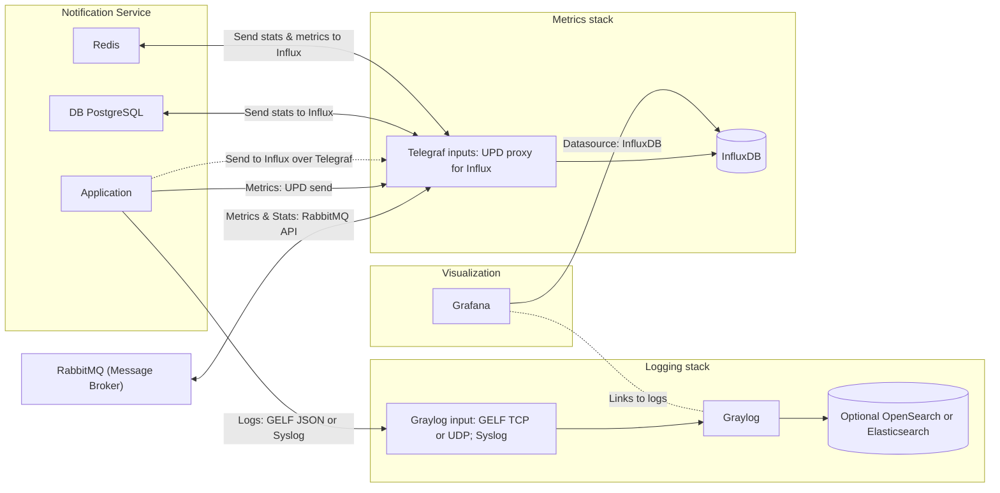
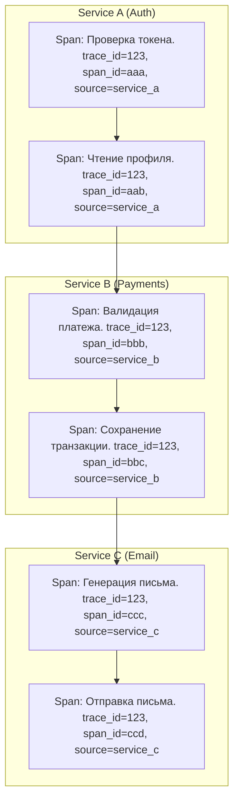

# Мониторинги, логирование и всё такое

Всем привет, сегодня мы обсудим (вернее я расскажу) о том, как лучше настроить мониторинги для вашего проекта. Поехали.

Начнём с самого главного - зачем вообще нужны всякие мониторинги? Всё очень и очень просто - следить за состоянием ваших сервисов. Начиная от загрузки CPU, оперативки и I/O операций, заканчивая кастомными метриками вашего сервиса (например количество заказов, разбитое по интервалам, или рассчитанная нагрузка по RPS/RPM/p95/p99). Именно мониторинги позволяют наблюдать за состоянием системы, а настроенные алертинги - предупреждать о каких-то проблемах ещё до того, как система начнёт сбоить, например если у вас % ошибок уровня *error* или *critical* выше, чем 10 - то система мониторинга шлёт вам письмо на почту, или в слак/линк (любой ваш корп мессенджер) и вы уже оперативно внедряетесь для разбора ошибок. Удобно? Конечно. И сегодня я вам расскажу, или может быть даже покажу, как такую систему можно выстроить, и с помощью каких инструментов. Но перед этим затронем ещё одну важную часть - системы для сбора логов.

## Логи

> [!TIP]
> Лог - это хронологическая запись наиболее значимой информации о работе системы.

Зачем нужны отдельные системы для логов, если можно просто писать их в файлики и не парится? Ответ тоже лежит на поверхности - централизованная система с возможностью фильтраций и поиска. Особенно если у вас микросервисная архитектура, когда нужно собрать логи операций сразу по всем сервисам при помощи trace id (или request id). Удобно и самое главное - продуктивно позволяет анализировать логи в случае ошибок, не нужно придумывать свои изощрённые системы или копаться в килотоннах строчек текста в текстовых лог файлах.

Давайте покажу на схеме:

И что же тут происходит? Мы видим `Notification Service` - наш микросервис, пусть он отвечает за отправку уведомлений пользователю. У этого микросервиса есть три "контейнера" - база данных PostgreSQL, key-value база Redis для кеширования, и сам контейнер приложения - Application, в котором вся бизнес-логика. И теперь представим, что таких микросервисов у нас 5, или вообще 15. Что нам делать с логами? Хранить отдельный файлик *application.log* вообще не вариант, если что-то сломается - бегать по всем микросервисам и колупаться по файликам выглядит как самая настоящая контрпродуктивная мера. Поэтому на сцену выходят системы для хранения логов, на диаграмме это `Logging stack`. Таких систем достаточно - на вкус и цвет как говорится.

Приведу примеры самых популярных (self-hosted):

- **Graylog** - удобный интерфейс, алерты, хранение в **Elasticsearch/OpenSearch** с очень удобным и мощным поиском
- **ELK** - классический энтерпрайз стек (**Elasticsearch / Logstash / Kibana**) - мощный, помимо логов используется как мониторинг, но прожорливый
- **OpenObserve** - open-source, конкурент ELK и Loki, быстрый и лёгкий
- **Fluentd / Fluent Bit** - агенты и маршрутизаторы логов, используются как сборщики
- **Vector** (опенсурс от Datadog) - агент от Datadog, много источников
- **Grafana Loki** - Дешёвое хранилище, индексация по метрикам, интеграция с **Grafana**, есть LogQL для сканирования логов, но при больших объёмах будет больно
- **Rsyslog / Syslog-NG** - системные логи в Linux/Unix OS
- **Sematext Logs** - частично OSS, чаще используется SaaS, вариант для логов и мониторинга
- **VictoriaLogs** - быстрый движок для логов, чаще для интеграции с VictoriaMetrics, но можно подключить к Grafana

А так же SaaS:

- **Splunk** - корпоративный/энтерпрайз стандрат, мощный но очень и очень дорогой
- **Datadog Logs** - часть Datadog экосистемы
- **LogDNA** - он же IBM Log Analysis - быстрый облачный сервис для логов
- **Sentry** - задумывалась как трекер ошибок для приложения, но часто используют вообще для всех логов, довольно дешёвый

И много других не самый популярных решений. В реальных системах часто комбинируют решения - агенты, хранилище и вывод логов (например *Vector -> Loki -> Grafana*).

Как можно понять из этого списка - систем для сбора ОЧЕНЬ МНОГО. Так как же выбрать, да что бы и работало исправно, и мощным было? ~~Graylog~~ Нужно отталкиваться от нескольких факторов - бюджет, мощность сервера, цели, архитектура приложения, контроль данных. SaaS решения - часто это дорого, все данные находятся на сторонних серверах, но если проект большой и логов очень много (терабайты в день) - то чаще это даже экономия, не нужно держать пул серверов на пару десятков терабайт, проще просто купить готовое SaaS решение (**Splunk** например). Если бюджеты средние, или если есть потребность хранить данные у себя - то можно рассмотреть **ELK** или **Graylog** - да, это жрущий стек (особенно ELK), потребуются более мощные сервера, но удобства управления логами перекроют эти минусы. Если же вы - стартап с бюджетом в три с половиной копейки - у вас сервера слабые и/или всего лишь один сервис (или парочку маленьких микросервисов) - берём **OpenObserve** или **VictoriaLogs (Loki) + Grafana**. Да, полнотекстовый поиск будет работать не так хорошо, как в Graylog, но зато удобно будет их просматривать. Но вне зависимости от бюджетов и прочих условий - старайтесь не писать логи в файлик! Это повышенная нагрузка на I/O, нужно выдумывать системы что бы этот файлик не разросся до нескольких десятков гигабайт, и работать с таким чудом очень сложно - появится баг, который фиксится за час, а логи вы копать будете часа три в лучшем случае. Лучше взять что-нибудь простенькое для начала, потратить время на настройку, но зато потом с кайфом работать. Или, если проект работает в докере, можно писать в stdout, а оттуда уже подхватывать через **Vector/Promtail**, но это скорее как компромисс и при условии, что у вас всё будет в докере постоянно. А если же всё равно хочется писать логи в файлик - думайте над ротациями (разделять по дням, делать автоматическую очистку старых логов и прочее). Мой выбор - **Graylog + OpenSearch + MongoDB** (Mongo нужна для хранения мета-данных Graylog'а, стоит это тоже иметь ввиду). Прожорливый, но зато очень удобный, а если ресурсы поджимают - можно заменить на **OpenObserve**. Он хоть пока и менее зрелый, зато даёт и SQL-поиск, и полнотекстовый поиск, да и кастомные поля гораздо удобней чем у Graylog.

Теперь будем определяться, что же вообще в логи нам писать? Какой-нибудь вордпрессник, или что ещё хуже - битриксоид ответит - конечно же ошибки! И на удивление для нашего канала я скажу, что... будет прав. Почти прав, вернее, частично прав. Логи ведь нужны не только для ошибок. Но, обо всём по порядку, и начнём мы с конфигурации лог-сообщения. В качестве примера я буду показывать скриншоты логов с Graylog, но все системы чем-то похожи.
Что вообще должно хранится в сообщении лога? Правильно, текст лога, временная метка, когда лог записался и уровень лога. Уровень лога - всего их существует 6, и он определяет значимость события (могут обозначаться либо "*OpenTelemetry стиль*" либо "*упрощённый стиль*"):

0. **TRACE** - сверхподробные отладочные сообщения, чаще всего они входят в DEBUG
1. **DEBUG** - простая дебаг-информация, в прод системах обычно этот уровень игнорируется
2. **INFO** - обычная информация об операциях (например "сервер запустился", или "начали обрабатывать сообщения из очереди")
3. **WARNING** - что-то пошло не так, как ожидалось/задумано, но на работоспособность не влияет (например вызов deprecated метода, или запрос идёт медленней чем ожидается)
4. **ERROR** - ошибка, операция не может дальше выполняться, но приложение продолжает работать
5. **FATAL** или **CRITICAL** - критическая ошибка, всё сломалось, приложение может упасть (или уже упало)

Так же по стандарту **[RFC 5424](https://www.rfc-editor.org/rfc/rfc5424)** (*Syslog*) **добавляются** ещё несколько уровней. Но *syslog* задумывался для логирования ядра Linux/Unix систем:

0. **EMERGENCY** - капут, система неработоспособна
1. **ALERT** - немедленные действия, например упала база данных, но приложение ещё работает
2. **NOTICE** - важное сообщение, но не ошибка (например кто-то залогинился)

В **PHP** **[PSR-3](https://www.php-fig.org/psr/psr-3/)** как раз следует **RFC 5424** стандарту, тогда как в микросервисах стараются использовать "упрощённый стиль". Да и системы визуализации и хранения логов довольно гибкие, у большинства систем поле Log Level может принимать то значение, которое сами ему и отправили.

Это - самый минимальный минимум, который нужен для лог-сообщения (лога). Но чем больше мы будем знать об инциденте, тем лучше. Поэтому, лучше всего ещё записывать *source*, *trace_id* (*request_id*), *span_id*, если у вас микросервисная архитектура. *Source* - название сервиса, который пишет логи, *trace_id* (*request_id*) - общий ID для запроса который идёт по стеку вызовов, *span_id* - ID стека вызовов операций внутри сервиса. Наглядней всего на схеме:

**Trace ID** приходит в хеадере запроса (например `X-TRACE-ID`), а каждый из сервисов имеет функционал, который проверяет этот хеадер, если он пустой - то генерирует этот ID, и потом просто прокидывает его в другие сервисы, которые он и вызывает. Нужен этот функционал для того, что бы можно было сразу отследить весь запрос и понять, из-за чего произошла ошибка, где она произошла и какой флоу данных. Очень удобно.

Так же, даже если у вас не микросервисная архитектура, всё равно лучше записывать в логи *context* - всякую мета информацию по типу *user_id* (если он есть), или *path* (путь запроса), *procedure* (если у вас **gRPC/JSON-RPC**), *source* тоже не будет лишним, ну и прочие поля, которые помогут локализовать ошибку и оперативно вмешаться. Чем больше мета-информации в логах - тем лучше, но самое главное - не переусердствовать, иначе можно просто утопить хранилище.
Вот так выглядит Graylog:

По порядку идут логи, чем выше - тем свежее. все они разделены по *source*, имеют *request_id* (это тоже самое что и *trace_id*), *log level* прямо в *message* (это не обязательно, хоть и даёт наглядность), так же эндпоинт (хоть тут он не совсем уместен, ибо **JSON-RPC**). Теперь посмотрим на отдельный лог:

Тут у нас идут все параметры лога, его мета-информация включая *client_ip* и *user_agent* (это я для тестов добавил, вообще они в микросервисах нужны в ограниченных местах, но вообще чувствительные данные лучше маскировать). По этим полям можно искать через строку поиска грейлога (у него свой "язык запросов" для поиска):

Сразу стоит оговорится, что всё описанное в *message* в квадратных скобках - это кастомная доработка на клиенте, делать её или нет - по желанию. Но как видим - всё очень удобно и ищется, и сохраняется. И это у меня только один сервис - если бы было несколько - то по *request_id* мы бы увидели сразу все логи с ним, но от разных сервисов (*source*). А вот в JSON'е примерная схема, какие поля желательно отправлять в систему сбора логов:
```json
{
  "message": "Текст лога",
  "timestamp": "2025-09-25T19:23:10Z",
  "level": "info",
  "env": "prod",
  "level_id": 1,
  "source": "my-service",
  "trace_id": "68d2a1ad08bff7",
  "span_id": "03919455",
  "http_method": "POST",
  "http_target": "/user",
  "http_status": 200,
  "duration_ms": 42
}
```
А для **ERROR/CRITICAL** логов можно ещё добавить несколько полей:
```json
{
  "message": "Ошибка",
  "timestamp": "2025-09-29T19:23:10Z",
  "level": "error",
  "env": "prod",
  "level_id": 3,
  "source": "my-service",
  "trace_id": "68d2a1ad08bff7",
  "span_id": "03919455",
  "http_method": "POST",
  "http_target": "/user",
  "http_status": 500,
  "duration_ms": 111,
  "stacktrace": "/var/www/my-service/cmd/server/main.go:12 error ...",
  "error_message": "error pointer to nil blah blah"
}
```
И будет у вас прекрасная информативная система для хранения и визуализации логов.
Теперь расскажу, что же вообще в логи записывать помимо ошибок? Всё зависит от бизнес-логики. Если что-то просто прочитать из базы данных - то достаточно будет логировать ошибки и какую-нибудь метрику со скоростью ответа базы, если у вас большой флоу бизнес-логики - то чуть ли не каждый шаг (особенно это актуально в финтех системах). Логи должны быть информативные, но тут самое главное - не переусердствовать - а то можно очень быстро забить хранилище логов. А что бы система не превращалась в помойку - можно настроить архивацию - горячие логи храним 7 дней, а всё остальное компрессуем (архивируем) и складываем в друго место, так можно сэкономить место на диске.

## Мониторинг

Так, с логами мы вроде бы разобрались. Теперь поговорим о мониторингах, ведь это тоже немаловажная часть для построения устойчивой системы. Зачем они вообще нужны, мониторинги эти? Да почти для того же, что и логи - следить за состоянием системы по определённым метрикам. А эти метрики могут быть какими угодно - начиная от CPU и RAM, заканчивая теми, что вы сами себе определите. Но обо всём по порядку - существуют системы для сбора и хранения метрик, и для их визуализации. Начнём со сбора - есть как специализированные системы, так можно использовать хоть базы данных. Вот какие системы хранения существуют:

- **Prometheus** - классика, не иначе. Time-series метрики (сбор и хранение), свой язык запросов PromQL. Подходит для кубика и микросервисов. Работает по pull модели - он сам опрашивает системы
- **VictoriaMetrics** - лёгкая, быстрая альтернатива прометею
- **TimescaleDB** - надстройка над PostgreSQL для временных рядов
- **InfluxDB** - база данных временных рядов. Удобно хранить данные по времени, используется свой язык запросов Flux (со второй версии)
- **OpenTSDB** - дремучее легаси на базе HBase, идём дальше
- **ClickHouse** - колоночная No-SQL база данных, мега быстрая на чтение, чаще используют для аналитики в highload системах

Ну и агенты для сбора метрик:
- **Telegraf** - экосистема InfluxDB, много всяких плагинов для сбора статистики/метрик начиная от системных, заканчивая RabbitMQ/Kafka
- **Node Exporter / cAdvisor** - экосистема прометея
- **Vector** (open-source Datadog) - да, помимо логов может собирать ещё и метрики
- **Fluent Bit / Fluentd** - аналогично как и вектор, хоть скорее для логов используют, но можно приспособить для метрик

Я думаю что даже битриксоиды и вордпрессники заметили одну вещь - для хранения логов могут использоваться не только специализированные системы, но и обычные базы данных. Да, даже **PostgreSQL** или **MySQL**, потому что средствам визуализации всё равно, откуда брать данные. В теории, вы можете сделать свою систему сбора системных метрик с помощью самописного агента на условном **Rust**, с базой данных **SQLite** и уже в **Grafana** настроить визуализацию из этой самой базы данных. Оп, тут я упомянул визуализацию, но не рассказал что это. Поправляюсь, читаем - среда визуализации метрик/статистики - сервис/программа, которая показывает информацию на основе данных, чем лучше "визуализатор" - тем тоньше можно его сконфигурировать. Например, что хоть и должно быть базой, но всё же, можно настроить "**алерты**" (уведомления) по определённым событиям. Например, собираем мы у сервиса такую метрику, как *Latency* (*задержка*), и если у нас эта самая задержка будет больше чем 300мс - система автоматически отправит нам уведомление, что бы мы пошли разбираться, что же случилось. Ну или например если нагрузка на CPU больше чем 90% - система нам автоматически сообщит, что "пошло что-то не так, проц погибает". Ну примеры вы можете придумать сами, я думаю вы поняли суть. Но не все системы визуализации имеют функционал "алертинга", и стоит это иметь ввиду. Вот вам список популярных "визуализаторов":

- **Grafana** - де-факто - стандарт индустрии. Умеет во много видов графиков, очень много датасурсов, а с 8-й версии уже встроена система для алертинга. А ещё через **Loki** (или **VictoriaLogs**) умеет работать с логами
- **Kibana** - как Grafana, только для **ELK** стека и более (во много более) прожорливей
- **Chronograf** - для **InfluxDB**, но не настолько обширная как Grafana
- **Redash / Superset / Metabase** - больше для BI, чем для мониторинга

И системы алертов:
- **Alertmanager** - для Prometheus
- **Kapacitor** - экосистема Influx
- **Zabbix** - сразу всё в одном. Скорее для мониторинга железа серверов

Лично я предпочитаю экосистему *InfluxDB + Telegraf + Grafana*, потому что... Удобно и приятно, легко конфигурировать. И теперь определимся, что же выбрать? Тут всё проще, чем с логами, ведь системы для визуализации частенько не зависят от системы хранения (вернее поддерживают многие), и можно их даже комбинировать. Поэтому тут либо **Prometheus** - если вы приверженец "старой школы", и готовы к тому, что для сбора метрик с конкретного сервиса вам придётся писать отдельный эндпоинт `/metrics`, ибо Prometheus работает по pull модели. Если же у вас очень много завязано на PostgreSQL и вы готовы запарится с **Timescale** - юзаем **PostgreSQL**. У вас очень много всяких данных для аналитики - **ClickHouse DB**. Если же у вас сервак слабоват и вы хотите "что-то похожее на прометея" - то **VictoriaMetrics**, хотите простоты и удобства при небольшом потреблении ресурсов - **InfluxDB + Telegraf**. Или, вы можете для одного типа метрик использовать **InfluxDB**, для другого типа - **ClickHouse**, а для третьего - вообще какой-нибудь **Vector**. Но всегда стоит помнить, что системой хранения (и даже сбора) метрик может быть всё что угодно. А вот с визуализацией всё ещё проще - если на вопрос "Вы завязаны на ELK стэк?" вы отвечаете "да" - то берём **Kibana**, в остальных случаях - **Grafana**. А, если вы хотите *полностью* подвязаться под **InfluxDB** (*TICK стэк*) - то **Chronograf**, но это абсолютно не обязательно. **Grafana** довольно лёгкая и умеет во много датасурсов (мест, откуда она берёт данные), в том числе и **Influx**. А вот с алертами - тут стоит опираться только на ваш выбор системы хранения и визуализации - если **Prometheus** и **Grafana** - то пофиг, Grafana умеет. Если **Influx + Chronograf** - то **Kapacitor**. Но повторюсь, все эти вещи можно комбинировать, например *Influx + Telegraf + Graylog + Grafana* в абсолютно реальном продукте одного из стримов бигтех компании живёт себе прекрасно уже кучу лет. А **Zabbix** хоть и all-in-one система, но стоит выбирать если вам надо мониторить железо сразу пула серверов и только их - в этом его фишка, но для микросервисов или контейнеров он будет избыточен и тяжеловат. Вот покажу вам скриншот того, какие датасурсы можно подключить в Grafana (их можно подключать сразу несколько):

И это лишь малая часть того, что можно через неё подключить! А вот так выглядят дашборды на примере сборанных из RabbitMQ через Telegraf и хранящихся в InfluxDB данных (вспоминаем первую схему из начала статьи, блок `Metrics stack`):

Повторюсь, **Grafana** - лишь визуализатор. Все данные тянутся из **InfluxDB**, который подключён как датасурс. Вот пример панели в JSON (что, к слову, очень удобно хранить в репозитории):
```json
    // panel.json — хранится в репозитории, автоматически импортится в Grafana
    {
      "type": "timeseries",
      "title": "Total Messages (all queues)",
      "gridPos": {
        "x": 0,
        "y": 0,
        "w": 12,
        "h": 8
      },
      "targets": [
        {
          "query": "\nfrom(bucket: \"monitoring\")\n  |> range(start: v.timeRangeStart, stop: v.timeRangeStop)\n  |> filter(fn: (r) => r._measurement == \"rabbitmq_queue\" and r._field == \"messages\")\n  |> filter(fn: (r) => exists r.queue)\n  |> filter(fn: (r) => exists r.vhost and r.vhost =~ /${vhost:regex}/)\n  |> group(columns: [])\n  |> aggregateWindow(every: v.windowPeriod, fn: sum, createEmpty: false)\n",
          "refId": "A",
          "queryType": "flux",
          "datasource": {
            "type": "influxdb",
            "uid": "${DS_INFLUXDB}"
          },
          "hide": false
        }
      ],
      "fieldConfig": {
        "defaults": {
          "custom": {},
          "unit": "none"
        },
        "overrides": []
      },
      "options": {
        "legend": {
          "displayMode": "list",
          "placement": "bottom",
          "showLegend": true
        },
        "tooltip": {
          "mode": "multi",
          "sort": "none"
        }
      }
    },
```
А вот так выглядят плохо расположенные графики на дашборде:

А вот лишь немногие варианты того, куда можно слать алерты - там дальше в списке есть и слак, и телеграм, и даже МС Тимс:


А ещё в графане есть огромное количество плагинов, на любой ~~вкус и цвет~~ стек и потребность:

А вот тут (это последний скриншот Grafana, обещаю) показаны графики, которые я собираю с самого `Notification Service` (снова вспоминаем самую первую схему):

Все данные которые представлены - при каждом запросе к микросервису отправляются в **Influx**, к которому в свою очередь подключается графана и отображает в виде графиков и не только. Возможности мониторингов безграничны.
А что же нужно передавать в мониторинг? Всё просто - начиная от CPU, RAM, I/O, трафика и заканчивая RPS/RPM, latency, [p95/p99](https://habr.com/ru/articles/909002/), все ваши бизнес-метрики по типу "количество доставленных/недоставленных уведомлений", "количество успешных/неуспешных заказов" и прочего, что показывает не только "физическое здоровье" сервера, но и "здоровье" самого продукта.

## Итоги

Ладно, хватит уже хвалить **Grafana**. Давайте подводить итоги, ну и в конце будет небольшая табличка для ориентирования по стекам логов и мониторинга. Первое, и наверное главное, что хочется сказать - вне зависимости от того, что вы выберете для мониторинга и логов - этот выбор будет большим помощником. Без этих систем будет очень тяжело вести и развивать проект, ведь логи - инструмент для расследования инцидентов, а мониторинг - инструмент для того, чтобы видеть проблемы ещё до того, как они выстрелят. И эти вещи очень помогут вам эффективно решать проблемы, которые будут возникать по мере жизни и развития проекта. Система логирования и система мониторинга должны быть с вашим проектом ещё до того, как он выйдет в продакшен, даже в стадию MVP, ведь без этого вам будет очень и очень сложно развивать проект, и эта сложность будет расти экспоненциально. Подытожим - логи и мониторинг - важная часть проекта, которую нужно настроить в самом начале, не взирая на лень или менеджмент. В одной галерке, к слову, где я грёб бэкендером, мне не разрешали ставить графану для метрик и логов, потому что это была "платная услуга для клиента" 🤡. И теперь только представьте, какого это было фиксить баги на большой CRM системе, написанной на стеке Laravel + Filament, которая могла не только на сайтик товарку выгружать, а ещё и на 4 маркетплейса, и с каждого выгружать отчёты по куче параметров. И боль была в том, что порой непонятно что произошло - то ли богомерзкий Filament опять чудит, то ли у Laravel опять случилась магия, то ли у маркетплейсов опять API поменялось без предупреждений, то ли диск забился из-за бесконечных догрузок фотографий товарки и классический "лог в файлики по дням" не может создаться, и приходилось всё ручками через `cat ~/app/storage/laravel-d-m-y.log` отсматривать и искать проблемы. Хорошо что я ушёл писать на **Yii 2** под большой проект в бигтехе... Ладно, сейчас не об этом - не повторяйте ошибок нищих галер - сразу ставьте все необходимые системы, и **вы** будете контролировать свой проект, а не наоборот.

## Дополнение

### Сравнительная таблица по системам сбора и хранения логов:

| Стек                                       | При каких условиях                                                                            | Особенности                                                                                   | Недостатки                                                                                                                         |
| ------------------------------------------ | --------------------------------------------------------------------------------------------- | --------------------------------------------------------------------------------------------- | ---------------------------------------------------------------------------------------------------------------------------------- |
| **Splunk (SaaS)**                          | нтерпрайз, большие бюджеты, терабайты логов в день                                            | Мощный поиск, алерты, готовое SaaS, не нужно держать свой парк серверов                       | Очень дорогой, все данные на сторонних серверах                                                                                    |
| **ELK (Elastic + Logstash + Kibana)**      | Средние/большие бюджеты, когда нужно мощное и зрелое решение                                  | Энтерпрайз-классика, поиски, дашборды, интеграции                                             | Очень прожорливый, тяжёл в администрировании                                                                                       |
| **Graylog + OpenSearch + MongoDB**         | Средний бюджет, нужен удобный UI и быстрый поиск                                              | Удобный интерфейс, кастомные поля, алерты                                                     | Прожорливый, требует ресурсов                                                                                                      |
| **OpenObserve**                            | Стартап/малый проект, нужен лёгкий аналог Graylog/ELK                                         | SQL-поиск, быстрый, лёгкий, OSS                                                               | Менее зрелый, коммьюнити меньше                                                                                                    |
| **Loki + Grafana**                         | Стартапы, простые системы, контейнерная инфраструктура                                        | Лёгкий, дешёвый, удобно в Grafana                                                             | Нет полнотекстового поиска                                                                                                         |
| **VictoriaLogs + Grafana**                 | Стартапы, микросервисы, слабые сервера                                                        | Быстрое лёгкое хранилище, хорошая интеграция с Grafana                                        | Молодой проект, меньше плагинов                                                                                                    |
| **Vector / Promtail (stdout → хранилище)** | Если всё в Docker и нужен компромисс                                                          | Лёгкий сбор логов из stdout                                                                   | Сам по себе не хранилище                                                                                                           |
| **Файлы с ротацией**                       | Только на самом старте проекта, очень ограниченные условия. Желательно сразу заменить решение | Самый простой способ                                                                          | Высокая нагрузка на I/O, неудобно анализировать                                                                                    |
| **Своё решение**                           | Если у команды есть ресурсы (деньги, время и желание "заморочиться")                          | Абсолютная кастомизация под проект, можно покрыть все потребности и построить систему "мечты" | Очень дорого по времени и деньгам, высокая поддержка, bus factor - риски, если знания сосредоточены у 1–2 человек, часто невыгодны |
### Сравнительная таблица по системам мониторинга:

| Стек                                  | При каких условиях                                                        | Особенности                                                                | Недостатки                                                                                                             |
| ------------------------------------- | ------------------------------------------------------------------------- | -------------------------------------------------------------------------- | ---------------------------------------------------------------------------------------------------------------------- |
| **Prometheus + Grafana**              | Классика, Kubernetes/микросервисы, готовность писать эндпоинты `/metrics` | Pull-модель, язык PromQL, огромная экосистема                              | Нужно писать метрики, тяжеловат для слабых серверов                                                                    |
| **VictoriaMetrics + Grafana**         | Если сервак слабоват, но нужен аналог Prometheus                          | Лёгкая и быстрая альтернатива, проще в настройке                           | Меньше интеграций, сообщество меньше                                                                                   |
| **TimescaleDB (Postgres)**            | Если всё завязано на PostgreSQL                                           | SQL-язык, хранение временных рядов, удобно для аналитики                   | Сложнее настройка, требует Postgres                                                                                    |
| **ClickHouse + Grafana**              | BigData, аналитика, очень много данных                                    | Очень быстрый движок для аналитики                                         | Требует продуманной схемы хранения                                                                                     |
| **InfluxDB + Telegraf + Grafana**     | Простота, удобство, лёгкость, небольшой overhead                          | Flux язык, богатая экосистема плагинов, легко конфигурировать              | Свои заморочки с версиями, Flux многим непривычен                                                                      |
| **InfluxDB + Chronograf + Kapacitor** | Если хотите полный TICK-стек                                              | All-in-one от Influx                                                       | Chronograf слабее Grafana, Kapacitor ограничен                                                                         |
| **Kibana (ELK)**                      | Если уже используете ELK                                                  | Плотная интеграция с Elastic                                               | Очень прожорлива                                                                                                       |
| **Zabbix**                            | Нужно мониторить пул серверов и их железо                                 | All-in-one: сбор, хранение, алерты, визуализация                           | Избыточен и тяжеловат для микросервисов/контейнеров                                                                    |
| **Своё решение**                      | При наличии бюджета и команды, готовой инвестировать в разработку         | Полный контроль и гибкость, идеальное покрытие бизнес-и технических метрик | Стоимость, длительная разработка и поддержка, высокая зависимость от ключевых людей (bus factor), чаще всего невыгодно |
