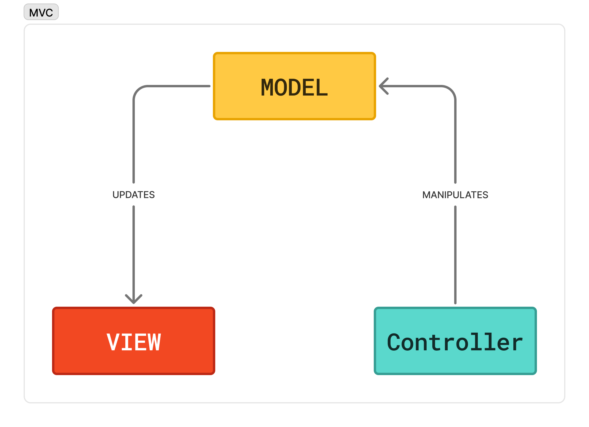
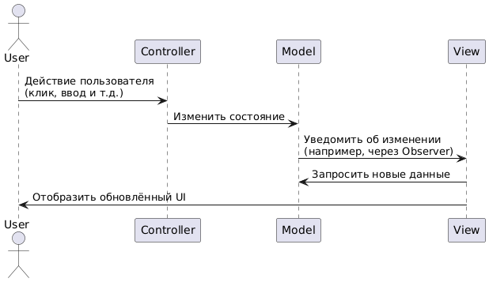
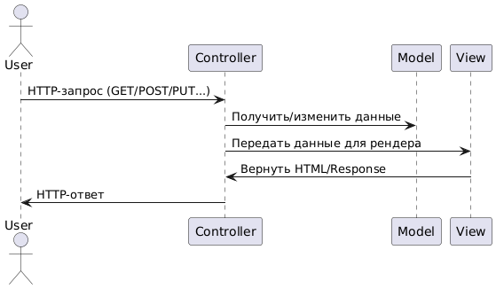
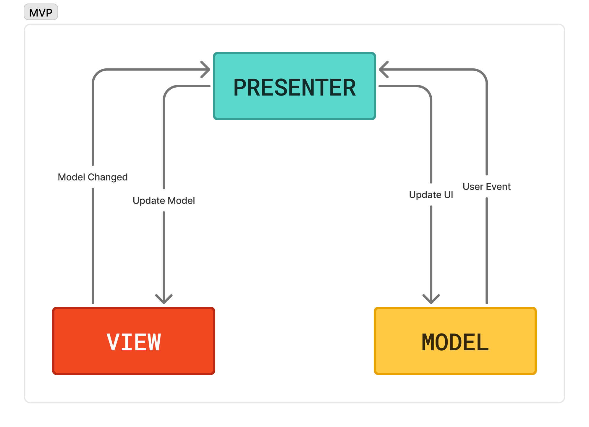
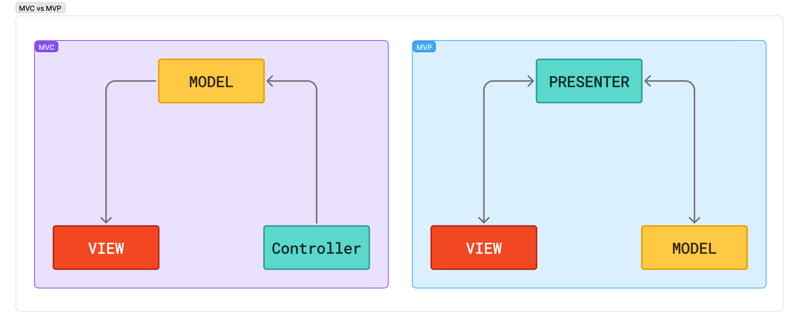
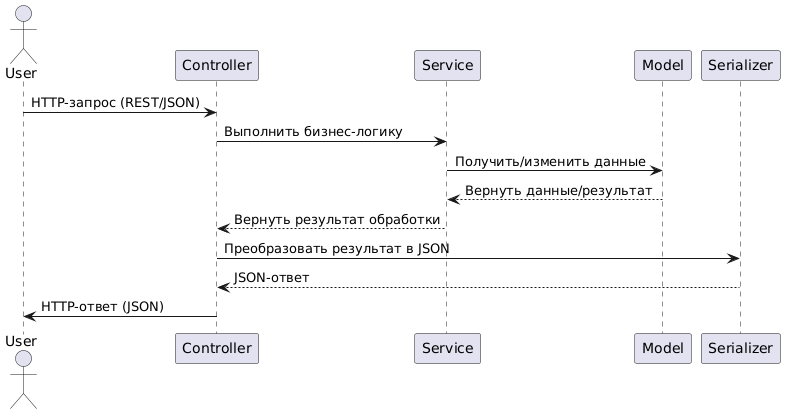
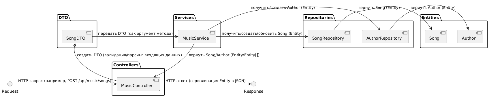

## MVC - не тот кем кажется

Все мы знаем такой архитектурный паттерн как MVC - Model-View-Controller. И всем мы его используем, так как в нашем Backend мире PHP это де-факто стандарт. Но что, если я вам скажу, что у нас в вебе произошла путаница, и MVC - это не то, что кажется? Давайте разбираться в этой статье.

Сразу вспомним схему работы этого паттерна:



Это классический **MVC** паттерн - **Model** работает с данными и бизнес-логикой, **View** - представление данных (отображение UI), а **Controller** занимается тем, что интерпретирует действия пользователя. Сам этот паттерн зародился не для веба, а для классических Desktop приложений или Fat GUI/Client applications, где всё живёт в памяти и все объекты реально общаются друг с другом. И классическая схема выглядит вот так:
Юзер что-то делает - *контроллер принимает событие* и *обновляет модель* (данные изменяет условно) - *модель изменяет своё состояние* и ***оповещает представление*** об этих изменениях - *представление **само меняет*** своё отображение после сигнала от модели.



А теперь разберём, как работает **MVC** в современном Backend'е:
Юзер что-то делает - *контроллер принимает* запрос, *обновляет модель* - затем *контроллер **сам** собирает данные* и *передаёт их представлению* - *представление просто отдаёт HTML/JSON* пользователю. И *представление само **ничего не знает*** ни о *модели*, ни о *контроллере*.



Ничего это не напоминает? Правильно, это же классический **MVP** - **Model-View-Presenter** (не путать с другим MVP - Minimal Viable Product)! Вот схема:



И теперь предлагаю сравнить два этих паттерна:



Да, по схеме - вебовский **MVC** - это классический **MVP**. Всё просто! То, что мы называем *Controller* - это и есть *Presenter*, который как раз обрабатывает и управляет данными. Почему так произошло - это отдельная история, и как бы мне не хотелось сейчас упрекнуть PHP-шников в создании такой путаницы за менее техническим бэкграундом у коммьюнити - такая путаница существует во всех фреймворках на разных языках (в т.ч. даже на Java). Но что есть, то есть. И кстати, если копаться чуть глубже - то вебовский **MVC** (**MVP**) корректней называть **CDA** или **HDA** (**Controller-Driven Architecture**/**Handler-Driven Architecture**), потому что мы на бэкенде очень часто занимаемся не целостными приложениями (Backend + Frontend), а проектированием **REST**/**RESTful** **API** (или даже **JSON-RPC**/**gRPC**), где *View* отсутствует как таковой *(В последующем при упоминании MVC будем считать, что я имею ввиду MVP или CDA, просто называю как MVC по традиции и для удобства)*.

Всё, вроде бы с этим разобрались. А теперь поговорим о недостатках этого паттерна в современной проектировке приложений. И сходу - у нас тут опять путаница. В оригинальных паттернах - модель отвечает не просто за данные, но и за бизнес-логику. А в современных фреймворках по типу Yii, Laravel, CodeIgniter (частично) модель - это просто слой работы с данными (как *Entity* в *DDD архитектуре*, или же как *Entity* в паттерне *Data Mapper ORM* по типу такого, как реализован в *Doctrine ORM*). И с этим проблема - нам приходится делегировать бизнес-логику либо в контроллер, либо же в саму модель, и из-за этого нарушается *принцип единой ответственности* (**SRP**) - ведь теперь контроллер - это не только слой который собирает данные и передаёт в модель, а ещё и исполняет всю логику. А если выносить бизнес-логику в модель - то **SRP** нарушается тоже, ведь в современной парадигме *модель* - это всего лишь источник данных, без логики. И поверьте моему опыту - часто такая проблема существует в проектах на Laravel - я видел проект одного моего прошлого коллеги, который считает себя middle (о современных PHP-шниках мы поговорим в следующих статьях). А теперь поговорим о решении этой проблемы. А решение очень простое, не нужно даже строить архитектуру по **DDD** (потому что **DDD** всё же больше про понимание бизнеса в целом) - выносить в отдельный слой всю бизнес-логику. И имя этому паттерну - **MVCS** (вернее **CDA+S**), где **S** - это **Services**. Один слой - и решает сразу несколько проблем. Вот небольшой пример (*serializer'ом* *можно пренебречь*):



Но и это ещё не всё - популярные фреймворки в качестве **ORM** используют паттерн *Active Record* (а те, что используют *Data Mapper* уже решили эту проблему). И это тоже черевато тем, что роль модели увеличивается - теперь это не только агрегатор данных, но ещё и слой работы с базой данных (даже не важно, это реляционная база, объектная или KV). И это, опять таки, тоже нарушение **SRP**.  И как противостоять этой проблеме - тут тоже всё просто. Делегируем работу с данными в отдельный слой - *репозитории*. Паттерн **Repository** как раз для этого и предназначен. Ну и ещё для обеспечения слабой связаности (*low coupling*), но мы это в рамках статьи затронем немного. И как же *красиво* использовать репозитории в связке с **ORM**, которые построенны на базе *Active Record*? Всё просто - контракты. Наши модели перестают быть одним целым - теперь они будут просто отвечать за доступ к базе данных, а нужные данные мы будем агрегировать на слои контрактов - условный Entity. А общение между слоями нам поможет обеспечить другой слой контрактов - **Data Transfer Object**, он же **DTO** (но в качестве исключения слой работы с данными - в репозиторий лучше передавать **Entity**). И вот теперь у нас появляется чистая архитектура, которая позволит проекту развиваться с гораздо меньшим накоплением "технического долга", и которую легко развивать и поддерживать. И такую архитектуру гораздо легче и прозрачней покрывать тестами. И очень удобно на такой архитектуре "городить" свои абстракции - где-то *фабрику* реализовал на уровне бизнес-логики, где-то *стратегию*, и всё не будет нарушать ни **SOLID**, ни *чистую архитектуру*. Кстати, предполагается, что все зависимости между слоями автоматически внедряются при помощи **Dependency Injection** pattern (**DI**). А вот и финальная структура (расширяющая **MVC**):
```
.
└── src/
    ├── DTO/
    │   └── Music/
    │       └── SongDTO.php
    ├── Controllers/
    │   └── API/
    │       └── MusicController.php
    ├── Entities/
    │   ├── Author.php
    │   └── Song.php
    ├── Repositories/
    │   ├── Contracts/
    │   │   ├── AuthorRepositoryInterface.php
    │   │   └── SongRepositoryInterface.php
    │   ├── AuthorRepository.php
    │   └── SongRepository.php
    └── Services/
        └── MusicService.php
```

Выглядит красиво, не правда ли? Идеальный компромисс между **MVC** (**MVP**/**CDA**) и монструозным **Domain-Driven Design**, который нужно строить полностью понимая специфику бизнеса, для которого проект и делается. И самое главное, что ещё стоит помнить - это минимальный шаблон архитектуры, который всего лишь... шаблон. Если нужно добавлять/убирать слои - то можно (а то и нужно) это делать, но самое главное - делать это нужно с умом и упираясь на требования проекта. Нужно добавить слой с сериализаторами - вперёд, бизнес-логика разрастается и сервис-классов становится нехватать - можно расширить сервисный слой, внося туда отдельные слои с билдерами/мутаторами и прочим:
```
.
└── src/
    ├── ...
    ├── Contracts/
    │   └── SerializerInterface.php
    └── Services/
        └── Music/
            ├── AuthorSerializer.php
            ├── SongMetaDataBuilder.php
            ├── SongService.php
            └── AuthorService.php
```

А ещё важный момент - этот шаблон *хорошо ложится* на *модульную архитектуру*, где каждый *модуль* - *отдельный слой*, со *своей **MVCS** структурой*. А при необходимости - вообще разбить на **CQRS** или **Event-Driven**! Самое главное - всё делать по уму, ведь гибкость - это двигатель чистоты в архитектуре. А вот и схема, как это всё взаимодействует:



На этом всё. Всем спасибо за прочтение этой статьи, и совет битриксоидам/вордпрессникам - идите и почитайте зачем вообще всё приложение на слои разделять, а потом вернитесь к моей статье снова. Всем пока.